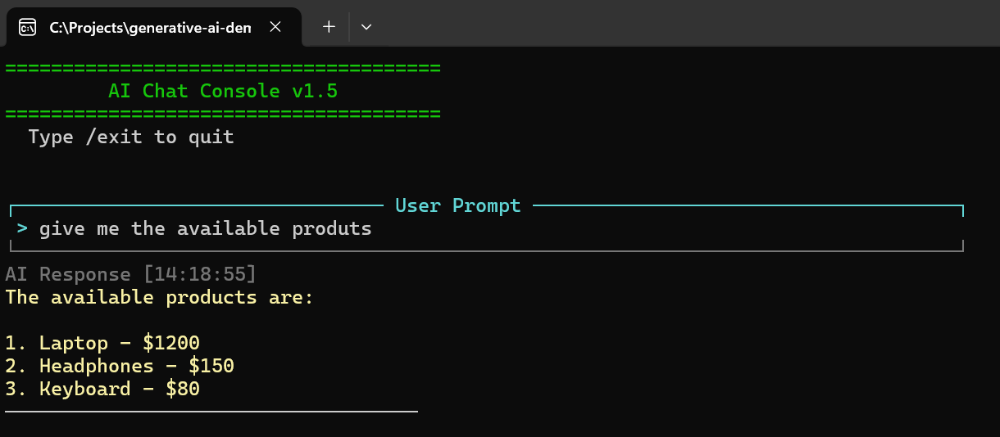




# 🧠 AI Chat Console v1.5

A simple interactive console chatbot application built with `.NET`, leveraging Azure OpenAI for **online** mode and **Ollama** (e.g., `llama3.1:8b`) for **offline** local inference.

This version introduces the integration of external tools (MCP tools) from a remote server (E-Shop), which the AI can invoke during conversations.



---

## 🚀 Features
- Streamed AI responses for real-time interaction
- **External Tool Integration**: The AI can dynamically use tools fetched from a remote server (e.g., E-Shop's tools).
- Online/Offline modes (switch between Azure OpenAI or Ollama locally)
- Maintains conversation history
- Clean and user-friendly terminal UI
- Graceful exit with `/exit` command
---

## 📦 Prerequisites

- [.NET 9](https://dotnet.microsoft.com/en-us/download)
- Optional for **Online mode**:
  - Azure OpenAI resource + valid API key
- Optional for **Offline mode**:
  - [Ollama](https://ollama.com/) installed and running locally
  - A supported model pulled (e.g., `llama3.1:8b`)

---

## 🛠 Configuration

The chat client can run in either **Online** or **Offline** mode:

```csharp
IChatClient client = BuildChatClient(ModelMode.Offline); // or ModelMode.Online
```

## 🔑 Online Mode Setup

To use Azure OpenAI:

- Ensure your Azure OpenAI resource is deployed and accessible.
- Replace the following in BuildChatClient():
```csharp
var endpoint = new Uri("https://YOUR-RESOURCE-NAME.openai.azure.com/");
var apiKey = new ApiKeyCredential("YOUR-API-KEY");
var deploymentName = "gpt-4o"; // Or your configured deployment
```

## 🦙 Offline Mode Setup

Make sure Ollama is running locally:
```bash
ollama run llama3.1:8b
```

## 💻 Usage

Run the application:

```bash
git clone https://github.com/ahedfi/generative-ai-demo.git
cd generative-ai-demo/Demo
dotnet restore
dotnet run --project EShop/EShop.csproj
dotnet run --project Demo/Demo.csproj
```

## 📦 Dependencies
-  Azure.AI.OpenAI
-  Microsoft.Extensions.AI
-  Microsoft.Extensions.AI.OpenAI
-  Microsoft.Extensions.AI.Ollama
- ModelContextProtocol
- ModelContextProtocol.AspNetCore

## 🧩 Additional Branches

This repository contains several branches with additional examples:

- [0.basic-chat-completion](https://github.com/ahedfi/generative-ai-demo/tree/basic-chat-completion)
- [1.demonstrate-system-prompts](https://github.com/ahedfi/generative-ai-demo/tree/demonstrate-system-prompts)
- [2.demonstrate-temperature](https://github.com/ahedfi/generative-ai-demo/tree/demonstrate-temperature)
- [3.demonstrate-structured-output](https://github.com/ahedfi/generative-ai-demo/tree/demonstrate-structured-output)
- [4.demonstrate-funcion-calling](https://github.com/ahedfi/generative-ai-demo/tree/demonstrate-funcion-calling)
- [5.demonstrate-mcp](https://github.com/ahedfi/generative-ai-demo/tree/demonstrate-mcp)


To explore these examples, simply switch to the desired branch:

```bash
git checkout <branch-name>
```

## 📄 License

MIT – feel free to use, modify, and share.